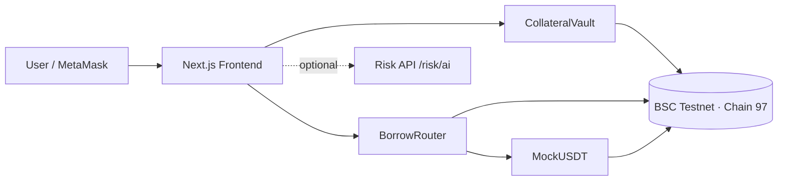
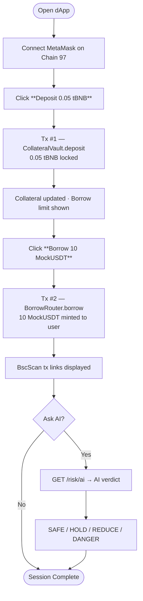

<p align="center">
  
  
  
  
</p>

# 🛡 SpendShield — Crypto Credit Without Liquidation Fear

> **#BNBHack Local Series** — Deposit BNB as collateral, borrow stablecoins instantly, and let our AI risk engine protect your position from surprise liquidations.

**Live Demo:** [frontend-one-gray-qspsgt0754.vercel.app](https://frontend-one-gray-qspsgt0754.vercel.app)  
**GitHub:** [github.com/s-hari-haran/BNB_Chain](https://github.com/s-hari-haran/BNB_Chain)

---

## Table of Contents

- [Problem & Solution](#problem--solution)
- [Architecture](#architecture)
- [User Journey](#user-journey)
- [Smart Contracts](#smart-contracts)
- [Tech Stack & Open-Source Dependencies](#tech-stack--open-source-dependencies)
- [Project Structure](#project-structure)
- [Setup & Deployment](#setup--deployment)
- [Live Testnet Proof](#live-testnet-proof-chain-97)
- [AI Risk Engine](#ai-risk-engine)
- [License](#license)

---

## Problem & Solution

| Problem | SpendShield Solution |
|---|---|
| Sudden liquidations wipe out DeFi borrowers | AI early-warning system monitors positions 24/7 |
| Users manually track collateral ratios | Real-time risk engine with SAFE / HOLD / REDUCE / DANGER verdicts |
| Complex multi-step borrowing flows | Simple **2-click** flow: Deposit → Borrow |
| Static, opaque liquidation thresholds | Dynamic 50 % LTV with transparent on-chain math |

---

## Architecture

```
┌──────────────────────────────────────────────────────────────┐
│                        USER (MetaMask)                       │
└────────────────────────────┬─────────────────────────────────┘
                             │  wallet_switchEthereumChain(0x61)
                             ▼
┌──────────────────────────────────────────────────────────────┐
│                  FRONTEND  (Next.js 14 / Vercel)             │
│  ┌──────────┐  ┌──────────────┐  ┌────────────────────────┐ │
│  │  Connect  │  │  Deposit     │  │  Borrow 10 MockUSDT   │ │
│  │  Wallet   │  │  0.05 tBNB   │  │  (via BorrowRouter)   │ │
│  └──────────┘  └──────┬───────┘  └───────────┬────────────┘ │
│                        │                      │              │
│  ┌─────────────────────┴──────────────────────┘              │
│  │  ethers.js v6 — BrowserProvider + Signer                 │
│  └──────────────────────┬────────────────────────────────────┘
│                         │
│         ┌───────────────┼───────────────┐
│         ▼               ▼               ▼
│  ┌─────────────┐ ┌─────────────┐ ┌─────────────┐
│  │ Collateral  │ │   Borrow    │ │  MockUSDT   │
│  │   Vault     │ │   Router    │ │  (BEP-20)   │
│  │  .sol       │ │  .sol       │ │  .sol        │
│  └──────┬──────┘ └──────┬──────┘ └──────┬──────┘
│         └───────────────┼───────────────┘
│                         ▼
│          ┌──────────────────────────────┐
│          │   BNB Smart Chain Testnet    │
│          │        Chain ID 97           │
│          └──────────────────────────────┘
│
│  ┌───────────── optional ──────────────────────────────────┐
│  │  BACKEND (Express.js)                                   │
│  │  GET /risk/ai?collateral=X&borrow=Y                     │
│  │  → AI Risk Engine → { verdict, confidence, reasoning }   │
│  └─────────────────────────────────────────────────────────┘
└──────────────────────────────────────────────────────────────┘
```

### Architecture Diagram (Mermaid)



---

## User Journey



### Step-by-Step

| Step | Action | What Happens On-Chain |
|------|--------|----------------------|
| 1 | **Connect Wallet** | MetaMask prompts. Frontend auto-switches to BSC Testnet (chain 97). |
| 2 | **Deposit 0.05 tBNB** | `CollateralVault.deposit{value: 0.05 ether}()` — BNB locked as collateral. |
| 3 | **Borrow 10 MockUSDT** | `BorrowRouter.borrow(10e18)` — verifies 50 % LTV, mints MockUSDT to caller. |
| 4 | **Check AI Risk** *(optional)* | Frontend calls `/risk/ai` → AI returns verdict + confidence + reasoning. |

---

## Smart Contracts

All contracts are written in **Solidity 0.8.24**, compiled with Hardhat, and verified on BscScan.

### MockUSDT.sol

| Function | Description |
|----------|-------------|
| `mint(address, uint256)` | Mint tokens (authorized minters only) |
| `burn(address, uint256)` | Burn tokens (authorized minters only) |
| `setMinter(address, bool)` | Owner grants/revokes minter role |

- Standard ERC-20 (OpenZeppelin) with Ownable access control

### CollateralVault.sol

| Function | Description |
|----------|-------------|
| `deposit()` | Payable — lock BNB as collateral |
| `withdraw(uint256)` | Withdraw collateral (if no outstanding borrow) |
| `getUserCollateral()` | Returns caller's collateral balance |
| `getCollateral(address)` | Returns any user's collateral balance |
| `setBorrowRouter(address)` | Owner sets the authorized BorrowRouter |

### BorrowRouter.sol

| Function | Description |
|----------|-------------|
| `borrow(uint256)` | Borrow MockUSDT up to 50 % LTV |
| `repay(uint256)` | Repay borrowed MockUSDT |
| `borrowed(address)` | Returns user's outstanding borrow |

- Uses `BNB_PRICE_USDT = 400e18` constant for collateral valuation
- Enforces **50 % LTV rule**: `borrowAmount ≤ collateralBNB × BNB_PRICE × 50 %`

---

## Tech Stack & Open-Source Dependencies

### Smart Contracts

| Package | Version | Purpose | License |
|---------|---------|---------|---------|
| [Hardhat](https://hardhat.org/) | ^2.22.10 | Solidity compiler, testing, deployment | MIT |
| [@nomicfoundation/hardhat-toolbox](https://www.npmjs.com/package/@nomicfoundation/hardhat-toolbox) | ^5.0.0 | Ethers, Chai, coverage, gas reporter | MIT |
| [@openzeppelin/contracts](https://www.openzeppelin.com/contracts) | ^5.0.2 | ERC-20, Ownable, ReentrancyGuard | MIT |
| [dotenv](https://www.npmjs.com/package/dotenv) | ^16.4.5 | Environment variable loading | BSD-2-Clause |

### Frontend

| Package | Version | Purpose | License |
|---------|---------|---------|---------|
| [Next.js](https://nextjs.org/) | 14.2.14 | React framework with SSR/SSG | MIT |
| [React](https://react.dev/) | 18.3.1 | UI component library | MIT |
| [ethers.js](https://docs.ethers.org/v6/) | ^6.13.2 | Ethereum/BNB Chain interaction | MIT |
| [TypeScript](https://www.typescriptlang.org/) | 5.6.3 | Type-safe JavaScript | Apache-2.0 |

### Backend

| Package | Version | Purpose | License |
|---------|---------|---------|---------|
| [Express](https://expressjs.com/) | ^4.19.2 | HTTP API server | MIT |
| [@anthropic-ai/sdk](https://www.npmjs.com/package/@anthropic-ai/sdk) | ^0.78.0 | AI risk engine inference | MIT |
| [ethers.js](https://docs.ethers.org/v6/) | ^6.13.2 | On-chain data reads | MIT |
| [Zod](https://zod.dev/) | ^3.23.8 | Request validation | MIT |
| [cors](https://www.npmjs.com/package/cors) | ^2.8.5 | Cross-origin requests | MIT |
| [dotenv](https://www.npmjs.com/package/dotenv) | ^16.4.5 | Environment variable loading | BSD-2-Clause |

### Fonts

| Font | Source | License |
|------|--------|---------|
| Space Grotesk | Google Fonts | OFL |
| Space Mono | Google Fonts | OFL |

---

## Project Structure

```
spendshield/
├── contracts/                # Hardhat project
│   ├── contracts/
│   │   ├── MockUSDT.sol          # Mintable BEP-20 stablecoin
│   │   ├── CollateralVault.sol   # BNB collateral deposits
│   │   └── BorrowRouter.sol      # Borrow logic + 50% LTV
│   ├── scripts/
│   │   └── deploy.js             # Deploy to BSC Testnet
│   └── hardhat.config.js
├── frontend/                 # Next.js 14 app
│   ├── app/
│   │   ├── page.tsx              # Main UI (neobrutalist design)
│   │   ├── layout.tsx            # Root layout + fonts
│   │   └── globals.css           # Design system
│   ├── .env.local                # Contract addresses + RPC
│   └── next.config.mjs
├── backend/                  # Express API
│   ├── src/
│   │   ├── server.ts             # /risk endpoints
│   │   ├── aiAdvisor.ts          # AI risk engine
│   │   └── config.ts             # Environment config
│   └── tsconfig.json
├── docs/
│   ├── ARCHITECTURE.md
│   ├── DEPLOYMENT.md
│   ├── DIAGRAMS.md
│   └── HACKATHON_ALIGNMENT.md
├── package.json              # npm workspaces root
├── docker-compose.yml
├── LICENSE                   # MIT
└── README.md
```

---

## Setup & Deployment

### Prerequisites

- **Node.js** ≥ 18
- **npm** ≥ 9 (workspaces support)
- **MetaMask** browser extension
- **tBNB** from [BNB Chain Testnet Faucet](https://www.bnbchain.org/en/testnet-faucet)

### 1. Clone & Install

```bash
git clone https://github.com/s-hari-haran/BNB_Chain.git
cd BNB_Chain
npm install
```

### 2. Configure Environment

```bash
copy .env.example .env        # Windows
# cp .env.example .env        # macOS / Linux
```

Set the following in `.env`:

```dotenv
PRIVATE_KEY=<your-deployer-private-key>
BSCSCAN_API_KEY=<your-bscscan-api-key>
ANTHROPIC_API_KEY=<optional-for-ai-risk-engine>
```

### 3. Deploy Contracts to BSC Testnet

```bash
npm run deploy:testnet -w contracts
```

The deploy script prints three contract addresses. Copy them to `.env` and `frontend/.env.local`:

```dotenv
NEXT_PUBLIC_CHAIN_ID=97
NEXT_PUBLIC_RPC_URL=https://data-seed-prebsc-1-s1.binance.org:8545
NEXT_PUBLIC_VAULT_ADDRESS=<CollateralVault address>
NEXT_PUBLIC_BORROW_ROUTER_ADDRESS=<BorrowRouter address>
```

### 4. Verify Contracts on BscScan

```bash
npx hardhat verify --network bsctest <MOCK_USDT_ADDRESS>
npx hardhat verify --network bsctest <VAULT_ADDRESS>
npx hardhat verify --network bsctest <ROUTER_ADDRESS> <VAULT_ADDRESS> <MOCK_USDT_ADDRESS>
```

### 5. Run Frontend (Local)

```bash
npm run dev -w frontend
# → http://localhost:5001
```

### 6. Run Backend (Optional — AI Risk Engine)

```bash
npm run dev -w backend
# → http://localhost:8080
```

### 7. Deploy Frontend to Vercel

```bash
cd frontend
npx vercel --prod
```

Set these environment variables in Vercel project settings:

| Variable | Value |
|----------|-------|
| `NEXT_PUBLIC_CHAIN_ID` | `97` |
| `NEXT_PUBLIC_RPC_URL` | `https://data-seed-prebsc-1-s1.binance.org:8545` |
| `NEXT_PUBLIC_VAULT_ADDRESS` | `<your CollateralVault address>` |
| `NEXT_PUBLIC_BORROW_ROUTER_ADDRESS` | `<your BorrowRouter address>` |

---

## BSC Testnet Network

| Field | Value |
|-------|-------|
| Network Name | BSC Testnet |
| RPC URL | `https://data-seed-prebsc-1-s1.binance.org:8545` |
| Chain ID | `97` |
| Currency | tBNB |
| Block Explorer | [testnet.bscscan.com](https://testnet.bscscan.com) |

---

## Live Testnet Proof (Chain 97)

### Verified Contracts

| Contract | Address | BscScan |
|----------|---------|---------|
| MockUSDT | `0xCA4c183f356012dEaB991B0e99dc6A70FC6a6d60` | [View Code](https://testnet.bscscan.com/address/0xCA4c183f356012dEaB991B0e99dc6A70FC6a6d60#code) |
| CollateralVault | `0x1a7060de7326F382F336061CEDFDdeD85ffD70A6` | [View Code](https://testnet.bscscan.com/address/0x1a7060de7326F382F336061CEDFDdeD85ffD70A6#code) |
| BorrowRouter | `0x6Bd89A062a16De900bC508E3eE4731dB0b5e4325` | [View Code](https://testnet.bscscan.com/address/0x6Bd89A062a16De900bC508E3eE4731dB0b5e4325#code) |

### Demo Transactions

| # | Type | Transaction Hash |
|---|------|-----------------|
| 1 | Deposit 0.05 tBNB | [0xc1e710…fa4bbb4](https://testnet.bscscan.com/tx/0xc1e710238f70fc74548098bdc20f1741eda3880f4280c99f409c6e38efa4bbb4) |
| 2 | Borrow 10 MockUSDT | [0xfe842d…15a73d8](https://testnet.bscscan.com/tx/0xfe842dc0407bd345b66945306d283bb390eedd8275f2940c2b7db35d015a73d8) |

---

## AI Risk Engine

The optional backend exposes an **AI-powered risk advisor** that analyzes borrower positions against market conditions.

### Endpoints

| Method | Path | Description |
|--------|------|-------------|
| GET | `/risk?collateral=X&borrow=Y` | Simple math-based risk score |
| GET | `/risk/ai?collateral=X&borrow=Y` | AI-powered verdict with reasoning |
| GET | `/risk/live` | Live market risk features |
| POST | `/risk/predict` | Batch prediction |

### AI Response Schema

```json
{
  "advice": {
    "verdict": "SAFE_TO_BORROW | HOLD | REDUCE_DEBT | DANGER",
    "confidence": 0.87,
    "summary": "Your position is well-collateralized...",
    "marketOutlook": "BNB showing stability...",
    "recommendation": "Safe to maintain current position...",
    "reasoning": [
      "Collateral ratio at 200% provides ample buffer",
      "Market volatility within normal range",
      "..."
    ]
  }
}
```

---

## License

This project is licensed under the **MIT License** — see the [LICENSE](LICENSE) file for details.

---

<p align="center">
  Built with 🛡 for <strong>#BNBHack Local Series</strong> · BNB Smart Chain Testnet (Chain 97)
</p>