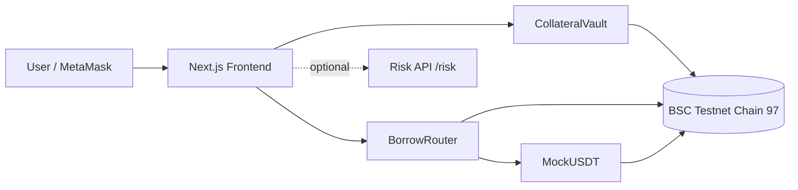
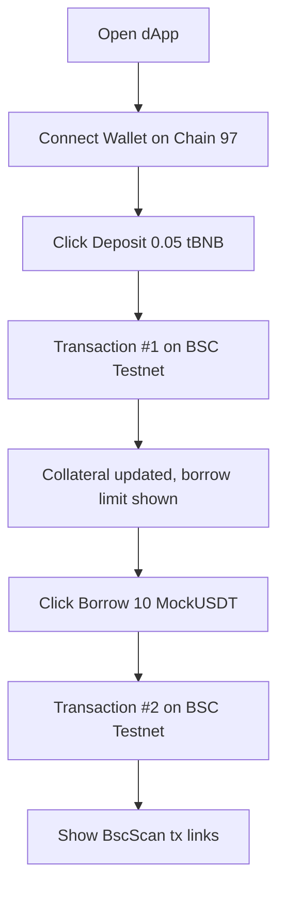

# SpendShield Diagrams

## Architecture Diagram

```mermaid
flowchart LR
  U[User / MetaMask] --> F[Next.js Frontend]
  F --> V[CollateralVault]
  F --> R[BorrowRouter]
  R --> T[MockUSDT]
  F -. optional .-> A[Risk API /risk]
  V --> B[(BSC Testnet Chain 97)]
  R --> B
  T --> B
```

## User Flow Diagram

```mermaid
flowchart TD
  S[Open dApp] --> C[Connect Wallet on Chain 97]
  C --> D[Click Deposit 0.05 tBNB]
  D --> D1[Transaction #1 on BSC Testnet]
  D1 --> L[Collateral updated, borrow limit shown]
  L --> B[Click Borrow 10 MockUSDT]
  B --> B1[Transaction #2 on BSC Testnet]
  B1 --> X[Show BscScan tx links]
```